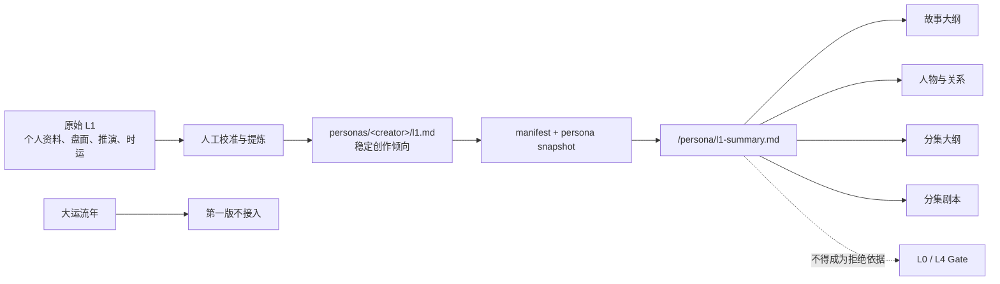

# L1 创作表达画像接入与时运隔离设计

> 状态：讨论稿，只描述功能增量和最小改造，不代表已经实现。
>
> 原始文件：本地受控资料 `docs/l9/L1命运.md`；不纳入运行时，是否进入版本库另行决定。
>
> 当前原文指纹：`sha256:3fc9ebd9c0ca293e8979d644ceb72993b216661a354f660f659f4502e799e5bf`
>
> 上游设计：[L0-接入设计.md](./L0-接入设计.md)

## 0. 结论

原始 L1 不修改，也不直接进入运行时。它同时包含精确出生资料、八字盘面、稳定人格推演、职业投影、大运流年和现实建议；这些内容的证据等级、有效期和运行权限不同，不能作为一整块提示词注入剧本 Agent。

第一版只接入其中经真人确认、能转译为创作动作的稳定表达倾向：

```text
原始 L1（人工来源，含盘面和时运，不进入运行时）
  -> 人工校准并提炼稳定创作倾向
  -> 更新 personas/<creator>/l1.md
  -> PersonaCatalog 只抽取 ## 摘要
  -> /persona/l1-summary.md 进入现有模型阶段
  -> agents.py 规定各阶段允许和禁止的用法
  -> 继续复用 manifest、snapshot、checkpoint 和现有 L0/L4 Gate
```

第一版明确不接入：

- 出生日期、出生时间、出生地点等原始个人信息。
- 四柱、十神、神煞、合化、刑冲破害等术数推演过程。
- 2026–2040 大运流年和“哪年适合做什么”的预测。
- “商业回报最好”“不宜推大项目”“需要某种搭档”等现实职业建议。
- 独立 L1 Gate、L1 Reviewer、L1 Memory、L1 Skill 或 L1 数据库表。

L1 在系统里的权限是：**软性创作镜头，不是事实来源，不是剧情模板，不是质量硬闸。**

它只回答“这个创作人格更自然地怎样观察和表达”，不能回答“这个故事必须写什么”。当 L1 与其他层冲突时，继续服从现有优先级：

```text
用户明确需求 / 已批准故事事实
  + L0 母题
  + L4 手艺与参数
  + L3 创作方法
  > L1 表达倾向
```

## 1. 需求与边界

### 1.1 功能目标

第一版需要做到：

1. 从原始 L1 提炼一份不含精确出生资料和流年预测的运行版 `l1.md`。
2. 运行版 L1 明确区分“来源解释”和“可执行摘要”。
3. 现有创作 Agent 能读取同一个不可变 L1 摘要，并按阶段采用不同用法。
4. L1 能影响观察角度、人物压力、动作和表达质感，但不能新增故事事实或覆盖用户要求。
5. L1 的更新继续通过 persona 版本、manifest hash 和 snapshot 冻结。
6. 旧任务继续使用创建时的人格快照，不受新版本影响。

### 1.2 非功能要求

| 类别 | 第一版要求 |
| --- | --- |
| 可复现 | 同一 run 始终绑定同一个 `snapshot_sha256`，中途更新 L1 不影响旧任务 |
| 隐私 | 运行版 persona 和 snapshot 不保存精确出生日期、时间、地点 |
| 可审计 | 运行版 L1 标明来源、确认状态、归属、原文指纹和推演边界 |
| 上下文成本 | 继续只注入 `## 摘要`，不把完整 L1 原文塞进每次模型调用 |
| 向后兼容 | 不修改九文件协议，不要求现有四个人格迁移新格式 |
| 权限隔离 | L1 不能改变 L0 选择、L4 参数、StoryContract、审核结论或项目状态 |
| 可维护 | 不解析八字术语，不在 Python 中维护术数规则或年度表 |
| 安全 | L1 只读、不可由任务反馈或模型自动改写 |

### 1.3 成功标准

第一版成功不是“模型会算八字”，而是同时满足：

- 能从运行上下文中看见经确认的 L1 摘要。
- 同一故事在使用该 L1 时能体现约定的观察和表达倾向。
- 人物、剧情事实、集数和质量标准仍由用户输入、已批准 checkpoint、L0、L4 和 StoryContract 决定。
- 最终 L0/L4 Gate 不会因为“作品不像八字”而拒绝。
- 任何模型输出都不能把 L1 推演包装成创作者或角色的已证实事实。

## 2. 原始 L1 的内容分级

原始文档不是单一类型资产，至少有四类内容：

| 类型 | 原文示例 | 第一版处理 |
| --- | --- | --- |
| A. 原始个人资料与盘面 | 出生日期、时间、地点、四柱、藏干 | 仅留在人工来源，不进入 persona |
| B. 稳定人格推演 | 温暖、文化养分、信念强、易与现实拉扯 | 人工核验后转译为创作倾向 |
| C. 时运预测 | 2026 火力顶峰、2029 冲突爆发、2030 收成 | 第一版不接入 |
| D. 现实职业建议 | 需要搭档缓冲、不宜硬推大项目 | 不作为 Agent 指令或业务决策依据 |

只有 B 类有资格进入第一版运行版 L1，而且不能照搬人格断语，必须转成可观察、可应用、可反证的创作操作。

### 2.1 从人格断语转成创作操作

| 原始推演表达 | 不应直接写入运行时 | 可提炼的创作操作 |
| --- | --- | --- |
| 丁火温暖、能照亮别人 | “创作者天生温暖” | 先建立人物间可见的照料和日常暖意，再让冲突破坏它 |
| 印重、文化养分厚 | “创作者有文化、有文采” | 重要价值观通过制度、职业、历史和具体物件落地，不用空泛金句 |
| 自我强、认死理 | “创作者固执、不愿妥协” | 关键人物需要有明确所信，并在压力下用选择和代价证明，不靠宣言 |
| 初心与现实相冲 | “他一辈子被理想与现实撕裂” | 可以关注信念遭遇现实压力时的人物行动，但是否作为本剧母题由 L0 决定 |
| 旺火易燃尽 | “创作者会过度投入” | 不进入剧本生成规则；它属于现实协作假设，不是作品内容 |
| 需要搭档缓冲 | “必须替创作者挡住平台” | 不进入 Agent；属于团队管理建议，需由真人独立判断 |

### 2.2 L1 与 L0 的边界

原始 L1 多次得出“初心 vs 现实”的结论，但该主题已经由 L0 负责。

两层不能重复拥有同一权限：

- L0 决定本剧要回答什么母题、选择哪个侧面、哪些表达不能接受。
- L1 只决定这个创作人格更自然地从什么细节、行动和压力进入表达。
- L1 不得因为原文出现“初心 vs 现实”，自行选择或改写 L0 侧面。
- L1 不得把所有题材、所有角色和所有冲突都压成同一个母题。

一句话：**L0 是“说什么”，L1 是经过校准的“更自然地怎么看、怎么起笔”。**

## 3. L1 在剧本 Agent 中的位置

### 3.1 目标分层



### 3.2 与 Hermes / OpenClaw 的类比边界

可以借鉴“每个 Agent 一套独立人格目录”的组织方式，但不能把 L1 等同于整个 `SOUL.md`：

| 通用 Agent 概念 | Pengine 对应物 | L1 的关系 |
| --- | --- | --- |
| Agent profile / workspace | `personas/<persona_id>/` | 整个人格目录可以类比 |
| 稳定身份与最高边界 | `project.md + l0.md` | L1 只是其中一个软性分面 |
| 项目工作规则 | `project.md + l4.md + agents.py` | L1 不承载流程和工具规则 |
| 长期记忆 | SQLite、checkpoint、反馈记录 | L1 不是从会话中生长的记忆 |
| Skill | `agent_skills/` 和按需技法 | L1 不是操作步骤，不做成 Skill |
| 临时 personality overlay | 未来可选的单次创作模式 | 时运若将来接入，只能位于这一层 |

Pengine 已有内容寻址快照，比直接读取可变人格文件更适合长篇创作恢复；L1 应复用这一机制，而不是另建通用 Agent workspace。

## 4. 可以直接复用的现有能力

| 现有能力 | 当前真实行为 | L1 最小方案如何复用 |
| --- | --- | --- |
| 九文件 persona 包 | 固定包含 `l1.md` 并参与 package hash | 直接把运行版 L1 放在现有位置 |
| L1 结构校验 | 要求存在“来源画像/原局/profile”和“摘要/summary”标题 | 保持现有标题，不新增 schema |
| `PersonaCatalog` | 创建内容寻址、不可变 snapshot | 直接冻结每次 L1 版本 |
| `_project_stage_context()` | 只抽取 L1 的 `## 摘要` | 继续作为唯一运行时主通道 |
| `/persona` 只读挂载 | Agent 可读、不可写人格文件 | 防止任务反馈或模型自改 L1 |
| `project.md` | 完整注入所有阶段 | 只写 L1 状态、权限和指向，不重复画像全文 |
| L0/L4 Gate | 负责母题和手艺验收 | 保持现有 Gate，不新增 L1 Gate |
| checkpoint / StoryContract | 保存已批准故事事实和约束 | 优先级高于任何 L1 推演 |

当前实现已经足以把压缩后的 L1 安全地送入所有阶段，因此第一版不需要修改 `personas.py`、`worker.py` 或 persona schema。

## 5. 运行版 `l1.md` 契约

### 5.1 文件职责

运行版 `personas/<creator>/l1.md` 只保存两类内容：

1. `## 来源画像`：说明这些创作倾向如何从原始 L1 经人工提炼而来，以及哪些内容已被排除。
2. `## 摘要`：模型真正会读到的稳定创作倾向、允许用途、禁止用途和仲裁关系。

运行版不能包含：

- 精确出生资料。
- 未拍板的身强弱、合化、暗合等判断过程。
- 具体年份、大运流年和年龄段。
- 对财富、事业、合作、健康、关系或项目成败的预测。
- 要求模型“相信八字正确”或替真人重新排盘的指令。

### 5.2 建议模板

```markdown
# <人格名> L1 创作表达来源画像

> 来源：由《L1命运》人工提炼的创作倾向，不是现实人格测评或命运预测。
>
> 原文指纹：sha256:<hash>
>
> 运行状态：创作者已确认 / AI 草稿待真人确认 · 归属：<归属方>。

## 来源画像

本画像只保留经确认、能转成创作动作的稳定表达倾向。
出生资料、术数推演过程、时运预测和现实职业建议不进入运行时。

## 摘要

- 定位：这是软性创作镜头，不是人物事实、剧情事实或质量标准。
- 稳定倾向：先建立人物之间可见的温度，再通过现实压力迫使人物选择。
- 稳定倾向：重要信念必须落在具体行动、制度、职业、物件和代价中，不用宣言代替戏。
- 稳定倾向：可关注坚持与现实的张力，但不得把所有题材和角色写成同一种冲突。
- 允许影响：观察角度、细节选择、人物压力、行动表达和对白质感。
- 禁止影响：L0 侧面、已批准故事事实、集数、StoryContract、L4 参数、项目排期和 Gate 结论。
- 仲裁：用户明确要求、已批准 checkpoint、L0、L4、L3 与本摘要冲突时，本摘要让位。
```

`## 摘要` 不追求“完整复述八字”，只保留每次模型调用都值得支付 token 的信息。

### 5.3 `project.md` 的写法

`project.md` 已完整注入所有阶段，但不应复制一遍 L1 摘要，否则同一规则会出现两个可漂移来源。

目标人格的 `project.md` 只保留状态和权限：

```markdown
## L1 摘要与状态

- [创作者已确认][归属：源] L1 是软性创作表达画像；具体内容读取
  `/persona/l1-summary.md`。它不得覆盖用户要求、L0、L4、已批准故事事实或 Gate。
```

运行时内容的唯一真源仍是 `l1.md` 的 `## 摘要`。

## 6. 分阶段使用规则

全阶段都能看见同一个 `/persona/l1-summary.md`，但用法必须不同：

| 阶段 | 允许使用 | 明确禁止 |
| --- | --- | --- |
| 确定 L0 侧面 | 可作为理解创作者表达习惯的次要背景 | 不能根据 L1 自行创造、替换或优先选择某个 L0 侧面 |
| 故事大纲 | 用于选择冲突呈现角度、人物行动和现实压力的质感 | 不能新增用户未要求的传记、时代、职业或“命定事件” |
| 人物与关系 | 用于让核心选择有信念与代价，并建立可见的温度 | 不能把所有角色复制成创作者本人，不能给角色贴八字标签 |
| 分集大纲 | 用于安排温度建立、压力升级和人物选择的落点 | 不能改变 L4 集数/节奏参数，不能覆盖 StoryContract |
| 分集剧本 | 用于动作、物件、对白和关系拉扯的表达方式 | 不能写命理解释、人格旁白或把推演结论塞进角色台词 |
| Canon / 连续性审核 | 不主动使用 L1 作为事实；只按锁定故事候选审核 | 不能把“不像 L1”判成 canon 错误或连续性错误 |
| L0 Gate | 保留上下文但只按 L0 审核 | 不能把 L1 作为通过或拒绝证据 |
| L4 Gate | 保留上下文但只按 L4 审核 | 不能把 L1 偏好升级为手艺标准 |

### 6.1 防止“所有人物都像创作者”

L1 描述的是创作者的观察镜头，不是剧中人物模板。提示词需要明确：

- 可以让某些关键场面体现该创作者擅长观察的张力。
- 不要求每个人物拥有同一种性格、价值观和表达方式。
- 角色行为首先服从人物小传、关系逻辑、StoryContract 和已写前缀。
- 反派、配角和对照人物必须从各自处境生长，不能只作为 L1 的反面工具。

### 6.2 防止 L1 变成第二个 L0

如果 L1 的创作倾向与已选 L0 侧面相似，Agent 也不能把两者合并成新的硬规则。

正确关系是：

```text
L0 决定本剧的母题和主要表达路径
  -> L1 提供可选的观察和表达镜头
  -> L3 决定创作时怎么思考和展开
  -> L4 决定作品必须达到的手艺标准
```

## 7. 第一版最小改造

### 7.1 Persona 内容

对目标创作者人格：

1. 新建或更新 `personas/<creator>/l1.md`，采用第 5 节模板。
2. 只写经真人确认的稳定创作倾向；未确认内容保留待确认标记并不得进入运行摘要。
3. 更新 `project.md` 中的 L1 状态和权限说明，不复制画像全文。
4. 更新 `manifest.json` 的 `l1.md`、`project.md` 文件 hash、`package_sha256` 和 persona 版本。
5. 由现有 `PersonaCatalog` 创建新的不可变 snapshot。

### 7.2 `agents.py` 提示词

在现有阶段 Prompt 中增加最小、通用的 L1 使用说明，不复制具体人格内容：

```text
Read /persona/l1-summary.md as an advisory creative lens.
It may shape observation, detail selection, character pressure, action, and dialogue texture.
It must not override user requirements, approved workspace facts, L0, L4,
StoryContract, episode count, or any quality-gate criterion.
Never treat L1 as a factual diagnosis or destiny prediction, and never clone the
creator profile onto every character.
```

然后按第 6 节只补充当前阶段的一句话重点。

不在 Python Prompt 中复制“丁火”“伤官”“初心 vs 现实”等具体内容，避免代码与 persona 双写。

### 7.3 不增加确定性 L1 校验

第一版不让 `personas.py` 或 `worker.py` 解析 L1 的人格语义，也不增加 `accepting_l1`：

- “有温度”“有文化厚度”“信念感”等是语义倾向，无法可靠地写成确定性规则。
- L1 没有像 L0 侧面 ID 或 L4 数字参数那样的机器合法值。
- 强行增加 L1 Gate 会把软性画像升级成硬模板，造成千剧一面。

程序层继续只承担现有工作：文件结构、状态标记、hash、snapshot、只读挂载和上下文长度限制。

## 8. 第一版不需要改动的模块

| 模块 | 不改原因 |
| --- | --- |
| `contracts/persona-package.schema.json` | 已有固定 `l1.md`，无需增加文件或字段 |
| `personas.py` | 已校验 L1 标题并抽取 `## 摘要` |
| `worker.py` | 已从 snapshot 汇总 persona 文件并只读挂载 |
| `schemas.py` | L1 不新增结构化模型输出或业务状态 |
| `repository.py` | snapshot 已承担版本冻结，不新增 L1 表 |
| API / frontend | 第一版没有新的用户选择、状态或页面 |
| Workflow 阶段 | 不新增 `selecting_l1`、`accepting_l1` 或独立 Reviewer |
| `series_bible.py` / `continuity.py` | 继续只管理已批准故事事实和连续状态 |
| `agent_skills/` | L1 是人格分面，不是可复用操作技能 |
| Memory / Store | L1 不应随普通任务反馈自动生长或覆盖 |

## 9. 时运部分的处理

### 9.1 第一版决定

第一版完全不把大运流年送入模型。

原因：

1. 它随日期变化，不属于稳定人格底盘。
2. 原文包含强职业和项目建议，容易越权影响真实决策。
3. 当前产品没有用户选择“是否使用时运”的交互和持久化字段。
4. 直接写入 `l1.md` 会要求每年更新 persona，并让旧文案自然过期。
5. 目前没有证据证明时运信息能提高剧本质量，先不为假设增加代码。

### 9.2 如果未来确有需求

未来只能作为用户明确启用、带有效期、冻结到单次 run 的创作 overlay，类似临时 personality，而不是修改稳定 L1：

```text
creative_season_overlay
  source_version
  effective_from
  effective_to
  enabled_by_user
  advisory_prompt
```

即使未来实现，也必须满足：

- 默认关闭。
- 用户在创建任务时明确启用。
- 只把内容转成创作气质建议，不提供职业、财富、关系或项目成败建议。
- 创建后与 run 一起冻结，恢复时不根据当前日期重新计算。
- 不进入 L0/L4 Gate，不改变预算、排期、集数、重试和发布行为。

该能力不属于本轮实施范围，不提前预留数据库字段或 API。

## 10. 风险、失效模式与缓解

| 失效模式 | 影响 | 第一版缓解 |
| --- | --- | --- |
| 原始出生资料进入 persona snapshot | 隐私扩散到快照、日志或交付环境 | 原始 L1 不复制；运行版禁止精确日期、时间和地点 |
| 模型把八字当事实诊断 | 捏造现实人格和经历 | 摘要明确“创作镜头、非事实”；Prompt 禁止事实化表述 |
| L1 覆盖用户故事 | 用户输入被人格设定吞没 | 用户要求和已批准 checkpoint 优先；阶段 Prompt 明确让位 |
| L1 复制 L0 | 所有作品被压成同一母题 | L0 决定“说什么”，L1 只决定观察和表达方式 |
| 所有角色都像创作者 | 人物同质化、关系失真 | 人物首先服从 biographies、relations、StoryContract 和处境 |
| `project.md` 与 `l1.md` 双写 | 两份摘要漂移、冲突 | `project.md` 只写状态和指向，内容真源只有 `l1.md` 摘要 |
| 时运内容长期驻留 | “当下年份”过期并污染新任务 | 第一版不接入；未来只允许带有效期的单次 overlay |
| L1 变成 Gate | 软偏好升级为硬模板 | 不新增 L1 Reviewer、Gate、通过率或拒绝状态 |
| 任务反馈自动改人格 | 单个用户把创作者画像带偏 | persona 快照只读；更新必须走人工确认和新版本 |
| 摘要过长 | 每次调用成本和注意力竞争上升 | 只保留稳定、可执行、可仲裁的条目；完整依据留在人工来源 |

## 11. 测试与验收

### 11.1 自动化测试

第一版只补与实际改动对应的测试：

- `tests/test_bundled_personas.py`
  - 目标 persona 的九文件、manifest 和 hash 合法。
  - `l1.md` 保留“来源画像”和“摘要”标题。
- `tests/test_personas.py`
  - `/persona/l1-summary.md` 只包含 `## 摘要`，不包含完整来源画像。
  - L1 摘要进入故事、人物、分集和剧本阶段。
  - persona snapshot 更新后旧 snapshot 仍可解析且内容不变。
- `tests/test_agents.py`
  - 生成阶段明确把 L1 定位为 advisory lens。
  - Prompt 明确 L1 不得覆盖用户要求、L0、L4、StoryContract 和已批准事实。
  - 人物阶段明确禁止把创作者画像复制到所有角色。
  - L0/L4 Reviewer 不把 L1 作为 Gate 标准。

不新增对“像不像某个八字”的字符串计数测试；它既不能证明创作质量，也会诱导模型机械复述人格词。

### 11.2 隔离真实模型验收

使用隔离 persona、临时 SQLite 和同一份故事输入完成一次对照验收：

1. A 组使用目标 L1 摘要。
2. B 组使用内容中性的 L1 摘要，其余人格文件、模型、用户输入和参数一致。
3. 人工比较故事大纲、人物与至少两集剧本。

需要观察：

- A 组是否在细节、人物压力、行动和对白质感上体现目标倾向。
- A/B 两组是否都遵守相同 L0、L4、集数和 StoryContract。
- A 组是否出现八字术语、命运预测、创作者传记补造或角色同质化。
- L0/L4 Gate 是否只使用各自标准，而未引用 L1 作为拒绝依据。

对照只能作为行为证据，不能把单次模型差异解释为 L1 的统计因果效果。

## 12. 原始 L1 更新方式

由用户明确触发：指定更新后的 L1，并要求重新分析。

```text
读取新原文并计算指纹
  -> 人工区分个人资料 / 稳定倾向 / 时运 / 现实建议
  -> 只比较稳定创作倾向是否变化
  -> 真人确认运行版变化
  -> 更新 persona/l1.md 和 project.md 状态
  -> 更新 manifest hash 和 persona version
  -> 生成新 snapshot
  -> 自动化测试 + 隔离真实模型验收
  -> 只让新任务使用新版本
```

| 原文变化 | 第一版系统处理 |
| --- | --- |
| 只修正盘面术语，不改变已确认创作倾向 | 更新人工来源记录；运行版可不变 |
| 稳定创作倾向发生变化 | 更新 `l1.md` 摘要、manifest、persona version 和回归用例 |
| 只更新当前年份或流年 | 第一版运行版不变 |
| 新增现实职业建议 | 不进入运行时 |
| 真人否定某条 L1 推演 | 删除或改写运行摘要，生成新 persona 版本 |
| 希望启用时运 overlay | 另开需求和设计，不在 L1 稳定摘要中偷渡 |

历史任务不迁移、不覆盖，继续使用创建时的 persona snapshot。

## 13. ADR-001：L1 采用人工编译的稳定创作分面

### 状态

Proposed

### 背景

原始 L1 同时包含个人资料、术数推演、稳定人格判断、时间预测和现实建议。Pengine 已有固定九文件 persona、不可变 snapshot 和摘要注入机制；需求是在不扩大运行面和风险的前提下，让其中对剧本表达有用的部分进入 Agent。

### 决策

采用“原始来源与运行版分离”的方案：

- 原始 L1 只供人工分析和校准。
- 运行版 `l1.md` 只保存经确认的稳定创作表达倾向。
- 模型只读取 `## 摘要`。
- L1 是 advisory persona facet，不是事实、记忆、技能或 Gate。
- 时运预测第一版不接入。

### 正面后果

- 复用现有 persona、hash、snapshot 和阶段上下文，无需新增系统。
- 限制精确出生资料在运行系统中的扩散。
- 降低八字推演越权影响剧情事实、项目决策和质量审核的风险。
- 旧 persona 和历史任务无需迁移。
- 以后可以独立更新 L1，而不修改工作流和数据库。

### 负面后果

- 人工提炼需要真人判断，不能通过一次自动导入完成。
- 运行版不会保留原始推演的全部细节。
- 第一版不能按年份自动改变创作气质。
- L1 的创作效果主要依靠提示词和真实模型验收，无法用简单确定性规则证明。

### 中性后果

- `l1.md` 继续参与 package 和 snapshot hash。
- 更新 L1 会产生新 persona 版本，只影响新任务。
- L1 与 L2/L3 一样以摘要形式进入上下文，但权限边界需要在 Prompt 中明确。

### 已考虑方案

**把完整 L1 原文直接注入所有阶段**

- 不采用：包含个人资料、时运预测和强现实建议，上下文过长且权限过大。

**把 L1 放进 `project.md` 或当作完整 SOUL**

- 不采用：`project.md` 是全阶段高频工作说明，完整 L1 会与 L0/L4 混权并形成重复真源。

**把 L1 做成 Memory**

- 不采用：L1 是经确认的人格资产，不应由普通任务和用户反馈自动增删。

**把 L1 做成 Skill**

- 不采用：L1 描述表达倾向，不是可触发、可执行的操作流程。

**新增结构化 L1 数据库和独立 Reviewer/Gate**

- 不采用：第一版没有需要持久化的新业务状态，也没有可靠的机器合法值；会把软画像错误升级成硬标准。

**把时运作为每次任务的自动上下文**

- 暂不采用：有效期、用户授权、产品价值和决策边界尚未验证。

## 14. 实施顺序

1. 由人工把原始 L1 分成个人资料、稳定创作倾向、时运和现实建议四类。
2. 由真人逐条确认哪些稳定倾向可以进入运行版。
3. 建立目标创作者 `personas/<creator>/l1.md`，使用第 5 节契约。
4. 更新 `project.md` 的 L1 状态和权限指向，删除重复画像。
5. 更新 persona version、文件 hash 和 `package_sha256`。
6. 在 `agents.py` 增加通用 L1 边界和分阶段使用说明。
7. 补 persona、Agent 和 snapshot 回归测试。
8. 运行项目测试和构建检查。
9. 使用隔离 persona 和临时 SQLite 做真实模型 A/B 行为验收。

## 15. 完成标准

- 原始 `L1命运.md` 内容和指纹不因接入而改变。
- 运行版 `l1.md` 不包含精确出生日期、时间、地点和具体流年预测。
- 运行版明确标注来源、确认状态、归属和“非事实/非预测”边界。
- `PersonaCatalog` 能按现有协议验证、快照并抽取 L1 摘要。
- 所有生成阶段能读取 `/persona/l1-summary.md`。
- Agent 明确知道 L1 只影响观察、细节、人物压力、行动和对白质感。
- L1 不能覆盖用户要求、已批准 checkpoint、L0、L4、StoryContract 或集数参数。
- 不新增 L1 Gate、Reviewer、Memory、Skill、数据库表、API 或前端页面。
- 现有四个人格无需迁移并继续通过测试。
- 新 L1 版本只影响新任务，旧任务恢复结果不变。
- 隔离真实模型验收没有出现八字术语泄漏、命运预测、角色同质化或 L1 越权审核。

## 16. 本轮最终方案

第一版只做“稳定创作倾向接入”，不做“八字系统接入”：

```text
docs/l9/L1命运.md（人工来源，不进入运行时）
  -> 人工确认的创作表达倾向
  -> personas/<creator>/l1.md（唯一运行版真源）
  -> 现有 PersonaCatalog 抽取 ## 摘要
  -> /persona/l1-summary.md（全阶段只读）
  -> agents.py（分阶段软性使用和禁止越权）
```

其余系统继续复用。只有稳定创作倾向的真实验收证明有价值后，才讨论是否需要带有效期、用户明确启用的时运 overlay；在此之前，不为预测性内容增加任何运行时复杂度。
