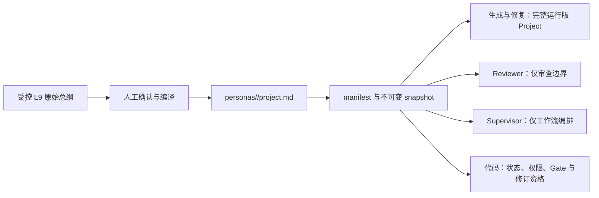

# 人格指令总纲短剧接入设计

> 状态：接入设计，已由 [Issue #112](https://github.com/mindcarver/pengine/issues/112) / [PR #113](https://github.com/mindcarver/pengine/pull/113) 实现。
>
> 原始文件：[人格指令总纲短剧.md](../人格指令总纲短剧.md)
>
> 当前原文指纹：`sha256:c5753d24254c16a618d328f80aaad6e93635a57fd443db5d9e41aefc38eeb5fc`
>
> 适用协议：Pengine persona v3 八文件协议。
>
> 本文只定义接入边界和实现方案，不代表原始总纲已经进入运行时。

## 0. 结论

《人格指令总纲短剧》应被定义为**某个具体短剧创作人格的 Project 宪章来源**，不是全项目通用提示词，也不是一份在每次请求中原样粘贴的 L9 原始资料。

以当前“守拙”人格为例，正确链路是：

```text
受控 L9 原始总纲
  -> 人工确认与编译
  -> personas/shouzhuo/project.md
  -> persona manifest + 不可变 snapshot
  -> 每个会生成或修改创作内容的真实模型请求
```

这里的“每次带入”必须精确定义为：

1. 每个创作任务绑定包含 `project.md` 的不可变 persona snapshot。
2. 每个可能生成或修改创作内容的模型请求，在 system prompt 中直接携带该 snapshot 的完整运行版 `project.md`。
3. Reviewer 不扮演创作者人格，只获得与审核职责有关的权限、仲裁和边界说明。
4. Supervisor 不创作内容，只负责编排，不重复携带完整人格正文。
5. 纯结构化结果序列化回合如果禁止改变已完成内容，可以不重复人格全文；一旦允许改变内容，就必须按创作调用处理。
6. 工作流顺序、只读、快照、重试、审核阻断和修订资格继续由代码与持久状态保证，不能交给提示词自觉。



第一版不新增 Agent、工作流阶段、数据库表、Memory、RAG 或跨任务自动学习。

## 1. 为什么它是 Project 宪章

原始总纲同时回答了五类问题：

1. **身份**：这个 Agent 是谁，以谁的创作人格工作。
2. **人格层索引**：L0、L1/L2、L3、L4、L5、L6 分别负责什么。
3. **仲裁**：不同要求冲突时听谁的。
4. **工作纪律**：如何触发、如何走创作链、如何交付。
5. **反馈边界**：用户意见和人格资产更新如何隔离。

这些内容的职责不是定义某一阶段的具体写法，而是让同一个 persona 在不同阶段保持一致身份和一致权限边界。因此它最接近通用 Agent 系统中的 Project instructions 或启动宪章。

它与其他运行文件的边界是：

| 文件 | 唯一职责 | Project 是否复制正文 |
| --- | --- | --- |
| `project.md` | 身份、层级索引、仲裁、工作纪律、反馈边界 | 自身即运行正文 |
| `l0.md` | 母题、侧面、雷区、温度 | 不复制，只引用 |
| `soul.md` | 稳定创作身份、观察与表达默认值 | 不复制，只说明权限 |
| `l3.md` | 创作决策方法 | 不复制，只说明权限 |
| `l4.md` | 创作者确认的剧作规则、建议及 Pengine 参数投影 | 不复制，只说明权限 |
| `l5.md` | 经授权的作品、经历和案例参考 | 不复制，只说明按需检索 |
| `l6.md` | 外部学习与技法参考 | 不复制，只说明按需检索 |
| checkpoint / Canon / StoryContract / SeriesBible / SeriesState | 本单已经锁定的事实和运行状态 | 不复制，由代码注入 |

`project.md` 不是比 L0 更高的一层内容标准。它是**说明各层怎样工作和怎样仲裁的路由宪章**，不能用自己覆盖 L0、L4 或已锁定事实。

## 2. 当前实现与缺口

### 2.1 已有能力

当前 Pengine 已经具备 Project 接入的大部分基础：

1. persona v3 把 `project.md` 作为固定文件之一参与结构校验、逐文件 hash、`package_sha256` 和 `snapshot_sha256`。
2. `PersonaCatalog` 在构造阶段上下文时把运行版 Project 挂载为 `/persona/project.md`。
3. Worker 从创建任务绑定的 snapshot 为所有 specialist stage 组装只读 `/persona` 文件。
4. 创建任务以后只引用 snapshot hash；源人格目录后续变化不会改变旧任务。
5. `/persona` 禁止模型写入，没有跨任务 `StoreBackend` 自动修改人格资产。

对应实现位置：

- [`src/pengine/personas.py`](../../../src/pengine/personas.py)：人格校验、快照和阶段上下文投影。
- [`src/pengine/worker.py`](../../../src/pengine/worker.py)：从 snapshot 组装所有阶段的 persona 文件。
- [`src/pengine/agents.py`](../../../src/pengine/agents.py)：Agent system prompt、权限、工具和模型调用边界。
- [`personas/shouzhuo/project.md`](../../../personas/shouzhuo/project.md)：当前守拙运行版 Project。

### 2.2 设计时缺口（已闭环）

PR #113 实施前只能证明 `project.md` **可被模型读取**，不能证明它在每个相关调用里**必定生效**。当时的缺口是：

1. Soul、L3、L4 已有明确的公共 prompt policy，Project 还没有对应的必带策略。
2. generation、repair 和 reviewer 都能看到 `/persona/project.md`，但是否主动读取仍可能依赖模型选择。
3. 部分 outline/story patch 通过直接模型调用完成，不依赖虚拟文件读取；这些路径当时只显式内联 Soul/L3，没有内联 Project。
4. Reviewer 如果无差别读取完整人格身份，可能把“像不像该创作者”错误变成审核依据，破坏独立审核。
5. 原始总纲中的若干产品承诺与当前实现不同，不能整份复制后宣称已经生效。

PR #113 已按本文方案闭环：五个内容生成/修复子 Agent 与两条直接补丁调用确定性内联完整 Project；Supervisor 不带全文，Reviewer 只接收独立审核边界，纯序列化结果重试不得修改内容。实现后的代码级事实以 `src/pengine/agents.py`、测试、README 与 Pages 为准。

## 3. “每次带入”的精确定义

### 3.1 必须完整带入的调用

以下调用会创造或修改创作内容，必须在每一个真实 provider 请求的 system prompt 中携带完整运行版 `project.md`：

| 调用角色或路径 | 原因 |
| --- | --- |
| `story_architect` | 选择 L0 侧面，生成故事大纲、人物小传和关系逻辑 |
| `episode_planner` | 生成分集大纲与 StoryContract |
| `script_writer` | 逐集生成剧本和状态变化 |
| `story_repair` | 修改尚未批准的故事或人物关系候选 |
| `episode_repair` | 修改当前尚未提交的分集剧本候选 |
| story/outline 直接 patch 调用 | 绕过虚拟文件工具，仍可能修改内容 |

这里推荐**直接把完整运行版正文内联进 system prompt**，而不是只要求模型调用 `read_file`：

- provider 请求本身即可证明内容已经被发送；
- 不依赖模型是否记得调用工具；
- 结构化重试和上下文压缩时不容易丢失人格宪章；
- `project.md` 较短，而且不复制其他人格层正文，成本可控。

`/persona/project.md` 仍然保留，用于只读上下文一致性、测试和人工审计，但创作调用不需要为了再次取得同一正文浪费一次工具调用。

### 3.2 不应完整带入的调用

#### Supervisor

Supervisor 只负责按顺序委派阶段、等待结果和结束工作流，不负责创作判断。完整人格正文进入 Supervisor 会：

- 重复消耗上下文；
- 增加 Supervisor 越权创作或改写任务的风险；
- 把人格规则与工作流协议混在一起。

Supervisor 只需知道：选定 persona 已冻结，所有创作 specialist 会收到它自己的 Project 宪章。

#### Reviewer

`quality_reviewer`、`canon_reviewer`、`episode_reviewer` 和 `series_reviewer` 必须保持独立。它们不应被提示为“你就是这位创作者”，也不应因为产物不像某种人格气质而通过或拒绝。

Reviewer 的 system prompt 只接收一份代码拥有的 Project 审查边界，不内联完整人格正文。由于当前 Agent 共用只读 persona 虚拟文件，`/persona/project.md` 仍可被 Reviewer 访问；这不等于要求它扮演该人格，Reviewer prompt 必须明确限制其使用方式：

1. Project 身份和风格不是 Gate 证据。
2. 只能依据当前 Reviewer 明确负责的 L0、L4、Canon、连续性、结构或反馈覆盖合同判断。
3. Project 不能新增 blocker，也不能覆盖用户要求和锁定事实。
4. 只有明确进入对应 Gate 的已确认规则才能阻断。

其中：

- `quality_reviewer` 在 `accepting_l0` 读取完整 L0，在 `accepting_l4` 读取完整 L4 投影；
- Canon、逐集连续性和全剧结构 Reviewer 只检查各自绑定的合同和证据；
- Reviewer 可以识别“人格内容越权进入角色或成品”的泄漏，但不能审核作品是否模仿创作者本人。

#### 纯结果序列化回合

当工作内容已经完成，模型只被允许返回一个现成的结构化 result tool call，而且 system prompt 明确禁止改写内容时，可以不重复完整 Project。

如果这个“纠错回合”仍允许修改故事、剧本、合同或修复方案，它就不是纯序列化，必须重新携带完整 Project。

### 3.3 不使用模型提示词的环节

以下规则必须由确定性代码、Repository 或数据库状态执行，不需要“带入提示词”：

- persona 文件集合、hash 和 snapshot 不可变性；
- `/persona` 只读权限；
- 阶段顺序和已批准 checkpoint；
- StoryContract、SeriesBible、SeriesState 和逐集前缀一致性；
- 模型调用预算、重试上限、暂停和 Continue；
- L0/L4/结构审核未通过时禁止正式交付；
- revision 是否可用、反馈是否冻结及可创建多少轮；
- 任务级反馈不得自动写回人格资产。

原则是：**模型负责理解人格，代码负责保证边界。**

## 4. 运行版 Project 的内容契约

### 4.1 必须保留

运行版 `personas/<persona>/project.md` 必须包含：

1. **身份与授权状态**：人格标识、适用创作范围、内容确认状态和归属。
2. **L0 运行引用**：变体、雷区和温度只引用 `/persona/l0.md`，不复制第二份正文。
3. **Soul、L3、L4、L5、L6 职责索引**：说明每层的作用和权限，不重复内容。
4. **最高工作纪律**：用户故事的主体性、L0 只读、创作事实不得由人格资产补造、案例不得冒充真实经历。
5. **仲裁规则**：明确事实/生产约束与创作人格层的两条优先链。
6. **工作流边界**：概述完整创作链和最终 Gate，但不复制状态机实现。
7. **反馈边界**：任务级意见只作用于本单；资产更新只由获授权真人确认并重新发布人格版本。
8. **来源指纹**：记录受控原始总纲的 hash，不把原始正文、私人资料或来源路径带进 prompt。

### 4.2 禁止包含

运行版 Project 不应包含：

- L0、Soul、L3、L4、L5 或 L6 的第二份完整正文；
- 原始 L1/L2 术数资料、出生信息、现实人格诊断或时间性预测；
- 未确认却写成事实的创作者经历、作品归属或授权；
- provider、模型名、Relay、数据库路径、内部工具名或实现细节；
- 当前产品并不存在的能力，例如无限修订、自动资产学习或已上线的跨任务侧面台账；
- 允许用户输入或模型输出直接修改人格资产的指令；
- 把 Project 身份或风格当成 Reviewer Gate 的规则。

### 4.3 两条仲裁链

不要把所有规则压成一条容易混淆的线性顺序。运行版 Project 应分别声明：

#### 事实与生产约束

```text
用户原始要求 / 冻结修订反馈
  -> 已批准 checkpoint 与 hard Canon
  -> StoryContract / SeriesBible / SeriesState
  -> 显式锁定的生产参数
  -> Pengine 默认参数
```

新阶段不能重开已经锁定的上游事实。用户的新意见如果需要改变已批准设计，应走正式 revision 或授权重建，不在当前调用中静默覆盖。

#### 创作人格约束

```text
L0
  -> 创作者确认的 L4 硬规则
  -> L3 创作方法
  -> Soul 创作默认值
  -> L5 / L6 按需参考
```

L3、Soul、L5、L6 都不能新增故事事实，也不能覆盖 L0、明确 L4 硬规则或锁定合同。Pengine 产品参数不属于创作者人格层；用户要求或锁定参数优先于默认值。

## 5. 原始总纲如何编译

原始文档不能直接复制到 `project.md`。接入时按以下映射人工编译：

| 原始章节 | 运行去向 | 处理方式 |
| --- | --- | --- |
| `你是谁` | `project.md` 身份与授权 | 只保留已授权、可公开的运行身份；未确认履历不进入 |
| `你服务的 L0 母题` | `l0.md` | Project 只引用，不复制母题、侧面、雷区和温度 |
| `人格底盘` 中 L1/L2 | `soul.md` | 去隐私、去术数、去预测，人工编译为创作行为 |
| `人格底盘` 中 L3 | `l3.md` | 编译为创作决策方法，不写现实人格判断 |
| `人格底盘` 中 L4 | `l4.md` | 区分确认硬规则、确认建议和 Pengine 参数 |
| `人格底盘` 中 L5/L6 | `l5.md` / `l6.md` | 授权后进入有界检索，不整体注入 |
| `最高铁律` | Project + L0/L4 | 治理边界留在 Project；具体创作规则回到对应层 |
| `层间仲裁` | `project.md` | 按当前 v3、Canon 和产品参数边界重写 |
| `被触发时怎么跑` | Project 摘要 + 代码状态机 | Project 只说纪律，代码保证顺序和阻断 |
| `二次产出` | Project 反馈边界 + Repository | 保留完整重跑与不污染人格原则；轮数服从当前产品合同 |
| `反馈与生长` | Project + 人工发布流程 | 任务级反馈隔离；资产级反馈不得自动写回 |

### 5.1 必须修正的旧表述

原始总纲包含以下不能按现状直接宣称的内容：

1. **L1/L2 运行层**：当前 v3 已由完整 `soul.md` 取代，不能继续要求运行时读取 L1/L2。
2. **跨任务侧面台账**：当前没有跨任务 Store 或侧面分布系统，只能作为未来独立能力。
3. **无限修订**：当前 revision 资格由 Repository 合同控制，Project 不得承诺无限轮次。
4. **两道总闸即全部审核**：正式交付还受 Canon、合同、逐集连续性和全剧结构审核约束。
5. **用户只能首次看到完整成品**：当前工作台会显示持久进度和已提交前缀；只有全部 Gate 通过后才是正式交付。
6. **违禁词表自动判定语义问题**：旁白解释、心理代写和文艺腔需要具体上下文证据，不能简单关键词阻断。
7. **用户反馈写入 L4/L6**：第一版没有自动写回；必须由真人确认、外部编辑、更新 hash 和发布新版本。

## 6. 建议的运行版模板

下面是结构模板，不是对守拙内容的替代定稿：

```markdown
# <人格名> Project 说明

> 来源：由受控《人格指令总纲短剧》人工编译。
>
> 来源指纹：sha256:<hash>
>
> 状态：创作者已确认 / AI 草稿待确认 · 归属：<归属方>

## 身份与授权

<该人格的运行身份、适用范围和明确授权边界。>

## L0 运行引用

完整 L0 只由 `/persona/l0.md` 承载，本文件不复制第二份正文。

### 变体

见 `/persona/l0.md`。

### 雷区

见 `/persona/l0.md`。

### 温度

见 `/persona/l0.md`。

## Soul 状态

<Soul 的职责、状态与权限。>

## L3 状态

<L3 的职责、状态与权限。>

## L4 状态

<L4 的职责、确认级别与权限。>

## L5 状态

<允许检索什么，哪些内容尚未授权。>

## L6 状态

<只作参考、不得换骨的边界。>

## 最高工作纪律

<任务主体性、只读、事实边界、不得冒充等稳定纪律。>

## 仲裁

<事实与生产约束链；创作人格约束链。>

## 固定工作流

<五类交付物、审核与正式交付的概述；状态由代码保证。>

## 验收闸

<Project 不新增 Gate；列明 L0/L4/Canon/结构审核各自职责。>

## 反馈与留白

<任务级反馈隔离、资产级人工确认、未知事实保持留白。>
```

这个模板保留现有 persona package validator 需要的身份、L0、变体、雷区、温度、Soul、L3、L4、L5、L6、铁律、仲裁、工作流、验收和反馈结构，同时避免重复各层正文。

## 7. 最小实现方案

### 7.1 人格资产

修改：

- `personas/shouzhuo/project.md`
- `personas/shouzhuo/manifest.json`

动作：

1. 由原始总纲人工编译运行版 Project。
2. 标注来源指纹、确认状态和归属。
3. 保持 Project 简短、阶段无关、不复制其他层正文。
4. 更新 `project.md` 文件 hash、`package_sha256`、persona 版本和最终 `snapshot_sha256`。
5. 旧 creation 继续使用旧 snapshot；新 Project 只影响升级后新建的任务。

### 7.2 Prompt 组合

修改 `src/pengine/agents.py`：

1. 新增一个只面向创作调用的 Project policy，例如 `_PROJECT_CREATIVE_POLICY`。
2. 新增 `_with_inline_project(prompt, persona_files)`：
   - 必须取得 `/persona/project.md`；
   - 把完整正文和权限说明放入 system prompt；
   - 不摘要、不检索、不静默截断；
   - 缺失时 fail closed，不继续创作。
3. 把它用于：
   - `story_architect_prompt`；
   - `episode_planner_prompt`；
   - `script_writer_prompt`；
   - `story_repair_prompt`；
   - `episode_repair_prompt`；
   - `generate_story_patch`；
   - `generate_outline_patch`。
4. 新增 Reviewer 边界，但不把完整人格身份内联给 Reviewer。
5. Supervisor prompt 不内联 Project，只声明 specialist 已绑定不可变 persona。

建议的创作侧公共 policy 语义是：

```text
完整运行版 Project 已随本次请求提供。它定义所选人格的身份、层级职责、
仲裁和反馈边界；必须全程遵守，但不能覆盖用户要求、锁定 Canon、L0、
适用 L4 硬规则或当前运行合同。不要把 Project 的来源、路径、内部层级说明
写入成品，也不要让所有角色模仿创作者本人。
```

### 7.3 无需修改

第一版不需要修改：

- persona schema 和八文件集合；
- `PersonaCatalog` 的 snapshot 机制；
- Worker 的 persona 文件组装；
- API 与前端；
- 工作流阶段和 Agent 数量；
- 数据库 schema；
- L0、L4、Canon、连续性和结构审核的职责；
- revision 数量与授权合同；
- Langfuse 或 SQLite 中的 prompt 正文保留策略。

## 8. 验证方案

### 8.1 确定性测试

在 `tests/test_personas.py` 和 `tests/test_bundled_personas.py` 验证：

- v3 包必须包含合法 `project.md`；
- 所有 specialist stage 的 persona context 都包含同一份 `/persona/project.md`；
- Project 参与 package/snapshot hash；
- 新版 Project 创建新 snapshot，旧 snapshot 仍能解析；
- Project 中待确认内容按现有规则不进入运行上下文。

在 `tests/test_agents.py` 验证：

- 用无敏感内容的唯一标记构造测试 Project；
- 每个 generation/repair provider request 的 system message 都包含该 Project 完整正文；
- story/outline 的直接 patch 请求同样包含完整 Project；
- 结构化 result-only 回合不能改变已完成内容；
- Supervisor 不包含完整 Project；
- Reviewer 不被指示扮演创作者，Project 身份和风格不能成为 blocker；
- Project 不能覆盖用户要求、Canon、L0、L4、StoryContract 或 SeriesState；
- 成品不得泄漏 `/persona/project.md`、来源指纹或内部人格层说明。

### 8.2 集成验证

使用隔离 persona snapshot 和假模型捕获真实序列化请求，逐项确认：

1. 初稿与 revision 都绑定正确 snapshot。
2. 故事、人物关系、分集大纲、逐集剧本和修复请求携带相同 Project 正文。
3. L4 仍只读取当前阶段投影，Project 不扩大 L4 范围。
4. Reviewer 只按相应合同判断，不因“不像该创作者”拒绝。
5. 失败、暂停、Continue 和恢复后仍绑定原 snapshot，不从变化后的源目录重新取 Project。

### 8.3 真实模型验收

真实模型验收必须在隔离数据目录、无私人原始资料的测试 persona 上进行。最少验证：

- 稀疏用户创意仍是唯一必填创作输入；
- 同一 Project 在故事、分集和修复阶段保持身份与仲裁一致；
- Project 没有被复制成角色台词、旁白或内部术语；
- Reviewer 保持独立，没有把人格相似度当成 Gate；
- SQLite 中的 snapshot、checkpoint、review 和 delivery 证据一致。

“模型确实理解了”不能从 HTTP 200 或文件存在推出。可验证事实是：正确 snapshot 已绑定、正确 Project 正文已进入实际序列化请求、模型输出和 Reviewer 证据符合合同。

## 9. 验收标准

实现完成必须同时满足：

- [ ] 原始 L9 总纲不直接进入 runtime、snapshot、prompt、SQLite 或 Langfuse。
- [ ] 运行版 `project.md` 有来源指纹、确认状态和归属。
- [ ] Project 不重复 L0、Soul、L3、L4、L5 或 L6 正文。
- [ ] 每个可能生成或修改内容的真实模型请求都携带完整运行版 Project。
- [ ] 直接 patch 和 repair 路径没有遗漏。
- [ ] Supervisor 不创作，也不重复携带人格全文。
- [ ] Reviewer 不扮演人格，身份和风格不是 Gate 证据。
- [ ] Project 不能覆盖用户要求、锁定事实、L0 或适用 L4 硬规则。
- [ ] 工作流、只读、快照、Gate、重试和 revision 仍由代码保证。
- [ ] 旧任务继续使用旧 snapshot，新版本只影响新任务。
- [ ] 人格包测试、Agent prompt 测试、完整非 live 测试、格式和构建全部通过。
- [ ] 隔离真实模型运行验证实际请求、持久状态和最终审核证据。

## 10. 风险与控制

| 风险 | 控制 |
| --- | --- |
| Project 与 L0/L3/L4 重复后漂移 | Project 只引用职责，不复制正文 |
| 每次内联增加 token 成本 | 保持 Project 简短、阶段无关；只在内容生成/修改请求完整带入 |
| Reviewer 被人格气质带偏 | Reviewer 不内联完整身份，只使用明确 Gate 和审查边界 |
| 原始资料泄漏 | 只保存人工编译运行版和来源指纹；不保存 L9 正文、私人路径或个人资料 |
| Project prompt injection 或越权 | 仅允许受控、确认、hash 固定的人格资产；用户输入不能写 `/persona` |
| 提示词承诺系统不存在的能力 | 修订、台账、反馈写回、状态恢复全部以当前代码合同为准 |
| 修改源目录影响进行中任务 | creation 只绑定不可变 snapshot，旧任务不重新读取源目录 |
| 只证明“文件存在”却声称“模型使用” | 测试实际序列化 system message；真实运行核对 snapshot 和请求证据 |

## 11. 非目标

本设计不处理：

- 自动解析或监听 L9 原始文档变化；
- 把 Project 拆成数据库字段或新的运行协议；
- 建立跨任务侧面分布台账；
- 自动把用户或运营反馈写回 L4/L6；
- 无限 revision 或多版本合并；
- 新增通用人格学习 Agent；
- 让 Reviewer 判断作品是否模仿现实创作者；
- 记录完整 prompt 或私人 persona 内容到观测系统。

## 12. 建议实施顺序

```text
1. 真人确认原始总纲中可进入运行版的身份与权限内容
2. 编译并审阅 personas/shouzhuo/project.md
3. 更新 persona 版本、文件 hash 和 package hash
4. 为创作/修复请求实现完整 Project 内联
5. 为 Reviewer 增加独立性边界
6. 补齐假模型请求捕获与 snapshot 测试
7. 运行完整非 live 测试、格式和构建
8. 使用隔离 snapshot 做一次新的真实模型初稿验收
```

在第 1 步完成前，不应把原始总纲中的现实身份、履历、授权或归属表述写成已确认运行事实。在第 8 步完成前，也不应宣称“人格指令已经在每次真实调用中生效”。
